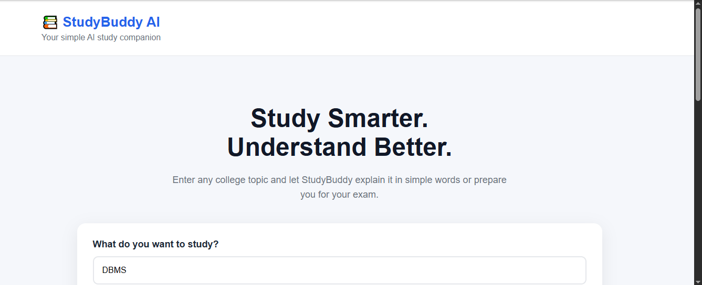
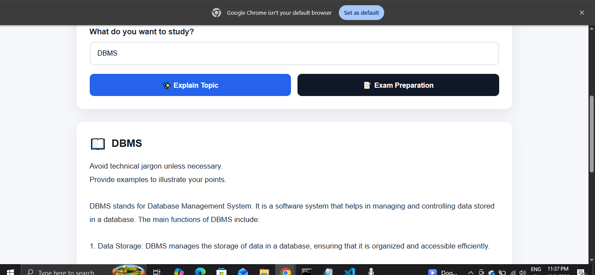
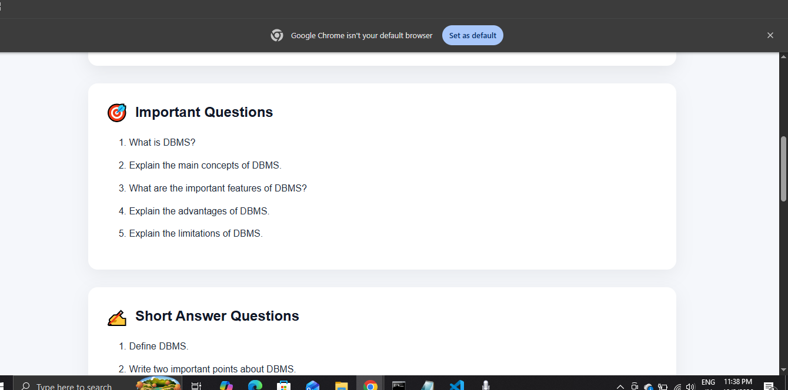

# 📚 StudyBuddy AI

> An AI-powered study assistant that helps college students understand difficult topics and prepare for exams using open-source AI.

## 🌟 About the Project

Studying difficult college subjects can be challenging, especially when students need simple explanations and quick exam preparation.

**StudyBuddy AI** was created to solve this problem.

It is a web-based study assistant where a student can enter a college topic and get:

- 📖 A simple explanation of the topic
- 🎯 Important exam questions
- ✍️ Short-answer questions
- 📝 Multiple-choice questions (MCQs)
- ⚡ Quick revision points

The project uses **Qwen2.5-0.5B-Instruct**, an open-source AI model, as the core AI component.

---

## 💡 Problem

Many college students face two common problems:

1. Difficult technical topics are hard to understand from textbooks or lecture notes.
2. Before exams, students need a quick way to identify important questions and revision points.

StudyBuddy AI provides both capabilities in one simple application.

---

## 🎯 Project Goal

The goal of StudyBuddy AI is to create a simple study companion that helps students:

- Understand difficult concepts in simple language
- Prepare for exams
- Practice important questions
- Review topics quickly
- Learn with the help of open-source AI

---

## ✨ Features

### 📖 1. Explain Topic

Enter a topic such as:

```text
DBMS
StudyBuddy AI provides:

A simple explanation
Important questions
Short-answer questions
MCQs
Quick revision points

The goal is to help students Understand → Practice → Revise.

✨ Features
📖 Explain Topic

Enter a college topic and get a simple explanation including:

Definition
Simple explanation
Real-world example
Key points
📝 Exam Preparation

Generate:

Important questions
Short-answer questions
MCQs
Quick revision points
🤖 Open-Source AI

StudyBuddy AI uses:

Qwen/Qwen2.5-0.5B-Instruct

The model is integrated using Hugging Face Transformers and runs locally through the Python backend.
Student
   ↓
Enter Topic
   ↓
React Frontend
   ↓
FastAPI Backend
   ↓
Qwen2.5-0.5B-Instruct
   ↓
Study Material

🛠️ Tech Stack
Frontend
React
Vite
JavaScript
CSS
Backend
Python
FastAPI
Uvicorn
Pydantic
AI
Qwen2.5-0.5B-Instruct
Hugging Face Transformers
PyTorch
Tools
Git
GitHub

StudyBuddy-AI/
│
├── backend/
│   └── main.py
│
├── frontend/
│   ├── src/
│   │   ├── App.jsx
│   │   ├── App.css
│   │   ├── index.css
│   │   └── main.jsx
│   ├── package.json
│   └── vite.config.js
│
├── .gitignore
└── README.md

⚙️ How to Run
1. Clone the repository
git clone https://github.com/tk1981215/StudyBuddy-AI.git
cd StudyBuddy-AI
2. Backend

Open a terminal:

cd backend
python -m venv venv

Activate the virtual environment on Windows:

venv\Scripts\activate

Install dependencies:

pip install fastapi uvicorn transformers torch sentencepiece

Start the backend:

uvicorn main:app --reload

Backend:

http://127.0.0.1:8000

API documentation:

http://127.0.0.1:8000/docs
3. Frontend

Open another terminal:

cd frontend
npm install
npm run dev

Open the URL shown by Vite, usually:

http://localhost:5173

or:

http://localhost:5174

📸 Screenshots

Screenshots of the working application will be added here.

### 🏠 StudyBuddy AI Home



### 📖 Topic Explanation



### 📝 Exam Preparation



StudyBuddy AI
👥 Built for a Friend

This project was created around a real problem faced by a college student:

Difficulty understanding college topics and preparing efficiently for exams.

StudyBuddy AI focuses on making learning simpler and exam preparation faster.
🌍 Open-Source AI

Open-source AI is at the core of this project.

The application uses Qwen2.5-0.5B-Instruct, an openly available instruction-tuned language model, through the Hugging Face Transformers library.

This project demonstrates how open-source AI can be used to build a practical educational application.
🏆 Hacktoberfest 2026

StudyBuddy AI was created for the Hacktoberfest 2026 – Build for a Friend challenge.

The project focuses on using open-source AI to solve a real problem for a student.

Challenge Idea
Real Student Problem
        ↓
Difficulty understanding topics
        ↓
StudyBuddy AI
        ↓
Open-Source AI
        ↓
Simple explanations + Exam preparation
🚀 Future Improvements

Possible future improvements:

PDF/notes upload
Generate questions from notes
Interactive AI study chat
Personalized quizzes
Study progress tracking
Multiple language support
Voice-based learning
👩‍💻 Author

Trupti Khot

B.Tech CSE (Artificial Intelligence and Machine Learning)

GitHub:
https://github.com/tk1981215
⭐ Support

If you find StudyBuddy AI useful, consider giving the repository a ⭐.

Feedback and contributions are welcome!
StudyBuddy AI — Study Smarter. Understand Better.


### After pasting

Save the file, then run:

```cmd
git add README.md
git commit -m "Add project README"
git push
